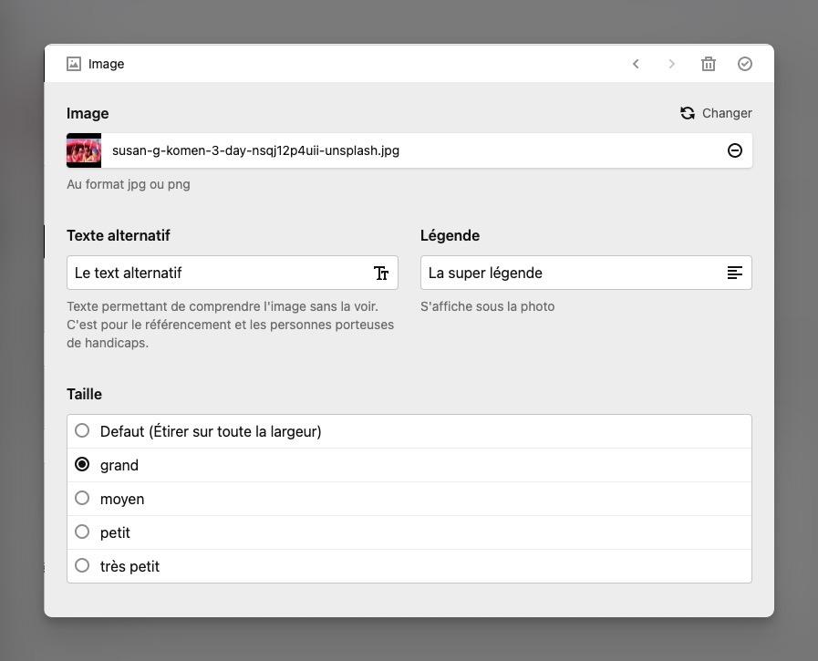

# Custom Image block for Kirby editor
The main feature is to select the size of an image.



## How to dev 
**Install dependencies**</br>
`npm install`

**Start watch process**</br>
`npm run dev`

**Start buil process**</br>
`npm run build`

## Config file thumb
Exemple of config for thumb to put in `config.php`
```php
'thumbs' => [
    'presets' => [
        'default' => ['width' => 1400, 'height' => 1400, 'quality' => 60],
        'xl' => ['width' => 1200, 'height' => 1200, 'quality' => 60],
        'md' => ['width' => 600, 'height' => 600, 'quality' => 60],
        'sm' => ['width' => 300, 'height' => 300, 'quality' => 60],
        'xs' => ['width' => 160, 'height' => 160, 'quality' => 60],
    ],
    'srcsets' => [
        'default' => [
            '1x' => ['width' => 800, 'height' => 800, 'quality' => 60,'format' => 'webp'],
            '2x' => ['width' => 1400, 'height' => 1400, 'quality' => 60,'format' => 'webp']
        ],
        'xl' => [
            '1x' => ['width' => 600, 'height' => 600, 'quality' => 60,'format' => 'webp'],
            '2x' => ['width' => 1200, 'height' => 1200, 'quality' => 60,'format' => 'webp']
        ],
        'md' => [
            '1x' => ['width' => 300, 'height' => 300, 'quality' => 60,'format' => 'webp'],
            '2x' => ['width' => 600, 'height' => 600, 'quality' => 60,'format' => 'webp']
        ],
        'sm' => [
            '1x' => ['width' => 150, 'height' => 150, 'quality' => 60,'format' => 'webp'],
            '2x' => ['width' => 300, 'height' => 300, 'quality' => 60,'format' => 'webp']
        ],
        'xs' => [
            '1x' => ['width' => 80, 'height' => 80, 'quality' => 60,'format' => 'webp'],
            '2x' => ['width' => 160, 'height' => 160, 'quality' => 60,'format' => 'webp']
        ],
    ]
],
```


## Disclaimer
This plugin is provided "as is" with no guarantee. Use it at your own risk and always test it yourself before using it in a production environment. 

## License
[MIT](https://opensource.org/licenses/MIT)

It is discouraged to use this plugin in any project that promotes racism, sexism, homophobia, animal abuse, violence or any other form of hate speech.
